# SEA_5_PHYSICS — How ships move, shoot and see

> Authoritative for movement, speed, environment, ranges, view, edges and rate
> limits. SEA_2_MATH stays authoritative where this document is silent. See
> "Which design document wins" in `AGENTS.md`.

Version 1.1 · Decisions locked 2026-09-04 · Companion to SEA_1_KNOWLEDGE, SEA_2_MATH, SEA_3_MECHANICS, SEA_4_TECHNICAL

This document explains the physics of Sea: how a ship moves, how far it can see and shoot, what wind and storms do, and how the server keeps everyone honest. It is written so that a new team member can read it once and understand the game, and so that every rule can be turned into a test.

The numbers in this document are the approved values. SEA_2_MATH copies them for reference. If a number here ever disagrees with SEA_2_MATH, this document wins and SEA_2_MATH must be fixed.

---

## 1. The idea in one page

Sea uses the same physics model as Seafight, because that model is what makes the game feel the way it does and because it runs cheaply for thousands of ships.

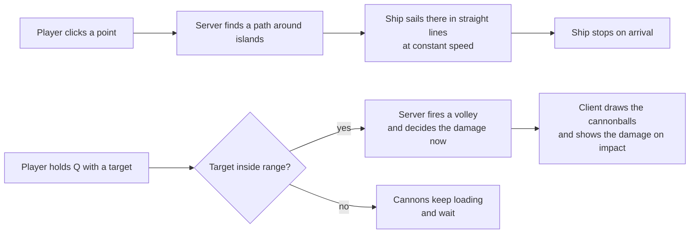

The five rules everything else comes from:

1. **One unit.** The whole game uses the "square" (sq). Positions, ranges, speeds, view, everything.
2. **Click to move.** You click a point; the ship sails there in straight lines at full speed. No inertia, no turning circle, no steering keys.
3. **Ships never bump.** Ships pass through each other. Only land stops a ship.
4. **Damage is decided when the cannon fires.** The cannonball you see flying is just a picture. You cannot dodge a shot that has already been fired.
5. **The server owns everything.** The client only sends wishes ("go here", "shoot that"). The server decides what actually happens.

What Sea adds on top of Seafight: a real heading (so armor faces matter), wind, storms and currents.

---

## 2. What Seafight really does (research)

Sources: the official Seafight Bible (Bigpoint forum), the Seafight fandom wiki, developer answers on the official board (2018–2026), and a decompiled Seafight client-bot on GitHub (Erawz/Seafight-Bot) that shows the real network messages and movement code.

### 2.1 Space

- A Seafight map is a diamond about **418 units** per edge. The game calls the unit a "square": cannon range is "30 squares", harpoon range is "10".
- Distance is plain straight-line distance between ship centres. No hitboxes, no ship size.
- A ship on the network is just: id, x, y, speed, and an optional list of waypoints. No rotation, no velocity.

### 2.2 Movement

- The client sends one message: `Move(x, y)`.
- The server replies with a `Route`: a list of waypoints. On open water it is one point; near islands the server adds corner points. **Pathfinding is on the server.**
- The client moves the ship every 100 ms along the route at constant speed. No acceleration, no braking, no turning radius. Stops dead on arrival. A new click replaces the route at once.
- Ships do not collide with each other. Only land blocks.
- Facing is only a picture: 4 sprite directions with a left/right "tacking" flip, or 8 directions. Nothing in combat depends on it.

Speed calibration taken from the bot's movement code (approximate):

| Displayed speed | ≈ sq per second | Time to cross one map edge |
|---|---|---|
| 385 (base elite hull) | 4.0 | ~104 s |
| 600 (hull + sails) | 6.3 | ~67 s |
| 1000 | 13.3 | ~31 s |
| 1500 | 20 | ~21 s |
| 2465 (theoretical max) | 33 | ~13 s |

Players say ships above ~2000 are "so fast you can't even target them". That is the ceiling of the feel.

### 2.3 Speed as a stat

- Base elite hull 385; sails up to +212; skills, crew, gems, buffs add more. Published maximum 2,465.
- Three **HP states** change speed: Normal (100–50% HP), Damaged (50–25%), Burning (25–0%). Sails stop counting as the ship burns. Max speed per state: 2,465 / 2,309 / 1,884.
- Cargo weight used to slow ships; it was removed years ago.
- Movement debuffs: Ice ammo can freeze (5–10% chance), Heartbreaker ammo can make the target sail randomly and stop firing (1%), Bloodfyre gives −5 range and −5 view distance for 10 s.

### 2.4 Attacking

- Click a target, press Attack once. The server then fires a full volley every reload for as long as the target is in range. `AbortAttack` stops it.
- Attacking never stops you sailing. Shoot-move-shoot ("kiting") is the main PvP skill.
- If the target leaves range, volleys pause and resume by themselves when it comes back.

### 2.5 Hits

- Each cannon has a hit probability (25% for an 8-pounder up to 100% for a Lava cannon) and the defender has a dodge chance. Hits are dice.
- The cannonball animation is purely visual. The server sends the hit result at fire time.
- Nothing blocks a shot: not islands, not ships, not towers.
- Reload: 50 s down to a hard floor of 1.5 s. Range: 5 to 34, up to 51.9 with every buff.

### 2.6 Boarding, maps, view

- Boarding: available when close (a few squares) to a target under the HP threshold; result is a number comparison; cooldown 60 s vs players, 15 s vs NPCs. No mini-game, no movement lock.
- Map change: sail into the edge band and click "Change maps". Into a Safe Haven there is a 15 s countdown that cancels on damage or movement.
- There is a hidden view-distance stat. The server only sends you ships that are near you.

---

## 3. Space and units

| Rule | What it means |
|---|---|
| **3.1** A map is a flat square of **400 × 400 sq**. (0,0) is top-left; x grows right, y grows down. | Seafight is ~418. 400 gives 70–90 s to cross a map at base speed. |
| **3.2** The square (sq) is the only distance unit in the game. | Ranges, speeds, view, zones, boarding: all in sq. Never pixels or metres. |
| **3.3** Positions are `f32` (x, y) in sq, on the server and on the wire. | The client draws at **32 px per sq** at 100% zoom (a map is 12,800 px wide). Pixels are a client detail. |
| **3.4** Every distance is straight-line distance between ship centres: `d = √((x1−x2)² + (y1−y2)²)`. | No hitboxes and no ship length. A Skiff and a Galleon are both a point. This keeps every check identical for every hull. |
| **3.5** Land is a 1-sq grid of water/land cells (160,000 cells per map), baked per map. | The server never lets a ship centre enter a land cell. |
| **3.6** Sea maps are drawn straight (not isometric like Seafight). | Camera and art choice only. No physics effect. |

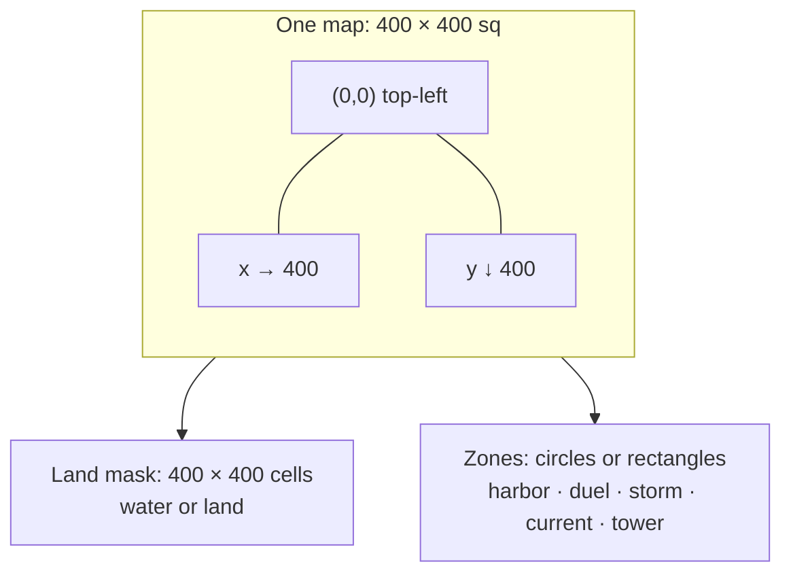

---

## 4. Movement

### 4.1 The rules

| Rule | What it means |
|---|---|
| **4.1.1** The only movement input is `MoveTo(x, y)` or `Stop`. | No held keys, no rudder, no throttle. "Sail to screen centre" and "sail to coordinates" are just a `MoveTo`. |
| **4.1.2** On `MoveTo` the server: clamps the point inside the map; if it is land, moves it to the nearest water within 3 sq or rejects it; builds a route; replaces the old route in one step; sends the route to everyone who can see the ship. | Every client draws the same line. |
| **4.1.3** A ship follows its route at its current speed (§5) in straight segments, waypoint to waypoint. Position is exact linear interpolation. | No acceleration, no braking, no drift, no turning circle. Arriving at the last waypoint stops the ship exactly there. |
| **4.1.4** `Stop` clears the route and the ship halts in the same tick. | Sinking, freeze, teleport and map change also clear the route. |
| **4.1.5** Routing: if the straight line to the target crosses no land, the route is one segment. Otherwise the server runs A* on the 1-sq grid (8 directions, diagonal cost √2) and then straightens the path into as few segments as possible that stay on water. Max **32 waypoints**. No path → the move is rejected with `NO_PATH`. | Islands are handled by waypoints, not by the client. |
| **4.1.6** Ships never collide with ships, NPCs, towers or projectiles. | Any number of ships can sit on the same point. Only land and map edges constrain movement. |
| **4.1.7** Heading is never an input and never slows a ship. Reversing direction is instant. | |
| **4.1.8** A new `MoveTo` takes effect at the next tick. Max **8 `MoveTo` per second** per ship; extra requests are dropped, not queued. | Dropped requests are counted for the trust score. |

### 4.2 Why no inertia

Seafight has none, and every habit players bring from it assumes instant response. Inertia also makes fighting at the edge of range feel laggy on a browser connection. Heading (§6) gives Sea positional depth without touching the movement feel.

### 4.3 How one move flows

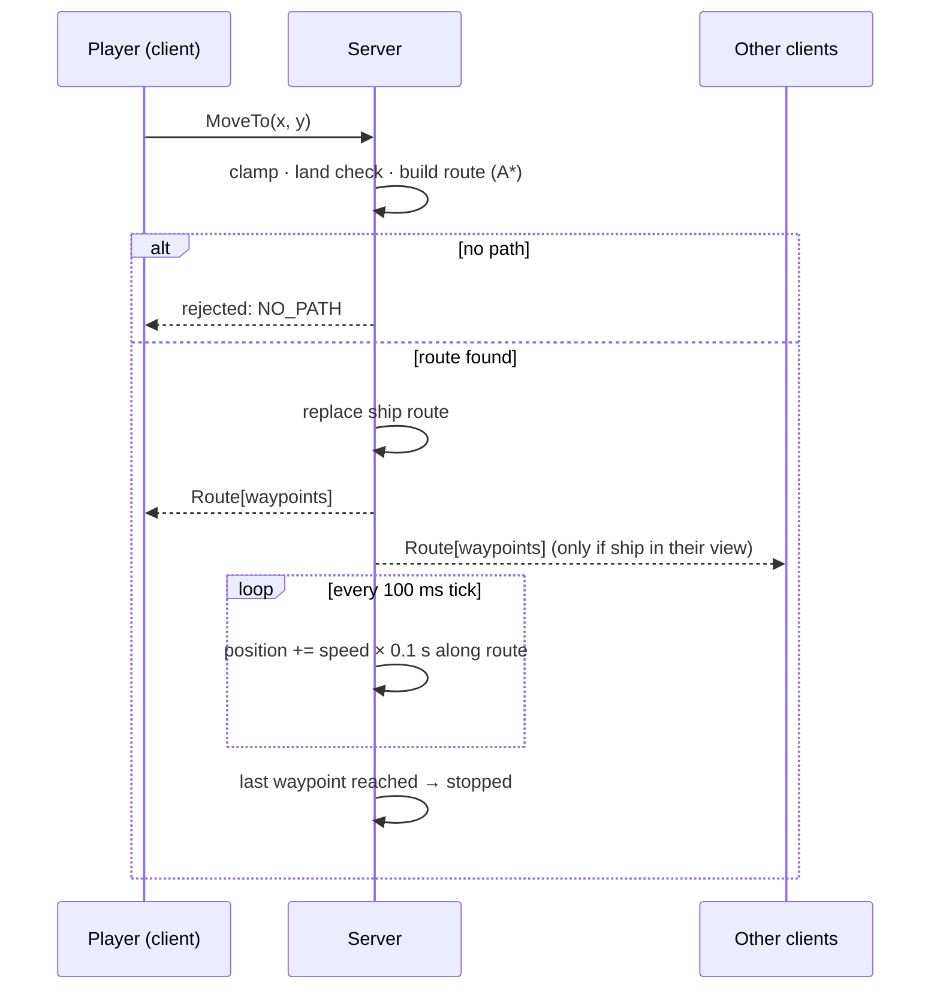

### 4.4 Base speed by hull

| Hull | Base speed (sq/s) | Time to cross 400 sq | Max with +25% cap |
|---|---|---|---|
| Skiff | 5.6 | 71 s | 7.00 |
| Sloop | 5.3 | 75 s | 6.63 |
| Brig | 5.0 | 80 s | 6.25 |
| Frigate | 4.7 | 85 s | 5.88 |
| Galleon | 4.4 | 91 s | 5.50 |

Why these values: Seafight's base hull moves ~4 sq/s and a normal PvP build 6–13 sq/s on a ~418-sq map. Sea sits at the lower end on purpose. Fights are meant to last 33–38 s; at 5 sq/s a ship closes a full tier-5 range (30 sq) in 6 s, which is enough time to reposition twice in a fight but not to run laps. Bigger hull = slower. The Skiff→Galleon gap is 27%: a Galleon cannot chase down a Skiff, but it can hold a Skiff in range for most of a fight if the Skiff commits.

---

## 5. Effective speed

### 5.1 The formula

```
speed = SPEED_BASE(hull)
        × (1 + min(0.25, sum of speed bonuses))     add, then cap
        × HP_STATE_MULT                              1.00 / 0.92 / 0.85
        × WIND_MULT                                  1 + 0.10 × cos(heading − wind)
        × STORM_MULT                                 0.85 inside a storm, else 1
        × DEBUFF_MULT                                product of slows, floor 0.50
then  velocity = speed along route + current vector  (current ≤ 0.3 sq/s)
```

Speed is recomputed every tick. The UI shows the server's number rounded to 0.1 sq/s.

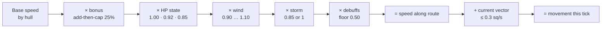

### 5.2 Each part explained

| Part | Rule |
|---|---|
| **Bonuses** | Speed bonuses from skills, crew and gear are summed and capped at **+25%** (this is the one number Sea keeps from SEA_2_MATH; see `stat_caps.json.speedBonusCap`). They spend the same 45-point Combat Power budget as everything else. |
| **HP state** | HP > 50% → ×1.00. 25% < HP ≤ 50% → ×0.92. HP ≤ 25% → ×0.85. Checked every tick; repairing above a line restores speed on the next tick. This is Seafight's three-state idea, made gentler. It lets the winner finish and stops "everyone escapes at 20%". |
| **Wind** | Each map has one wind direction per 8-hour band. The band is derived from the world tick counter, not from the wall clock: band = floor(tick / 288000), which is 8 hours at 10 Hz. Wall-clock time cannot be used because a replay of the same command log has to produce the same wind. Sent to clients. Straight downwind +10%, straight upwind −10%, side wind 0. A stopped ship feels no wind. Wind never bends a route; it only changes how fast you move along it. |
| **Storm** | A storm is a circle of radius **40 sq** that drifts at **0.5 sq/s**, lives 10–20 min, 0–2 per map. Inside it speed is ×0.85. Stacks with wind (worst case 0.85 × 0.90 = 0.765). |
| **Currents** | Zones with a fixed vector, at most **0.3 sq/s**. The vector is added to the ship's movement every tick, so a stopped ship drifts. Drift stops at land and at the map edge. |
| **Debuffs** | Slows multiply together, never below ×0.50. **Freeze** is separate: speed 0, route kept, ship resumes when the freeze ends. |
| **Cargo** | No cargo weight. Trade goods and ammo never change speed. |

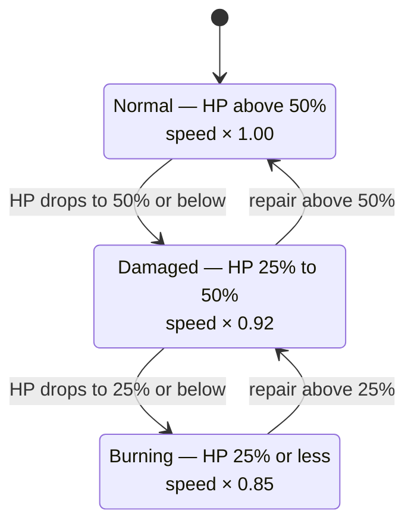

### 5.3 The extremes (checked)

- Fastest possible ship: Skiff 5.6 × 1.25 × 1.10 = **7.70 sq/s**, plus up to 0.3 sq/s of current.
- Slowest possible ship: Galleon at ≤ 25% HP, in a storm, sailing upwind: 4.4 × 0.85 × 0.85 × 0.90 = **2.86 sq/s**.

---

## 6. Heading and armor faces

Seafight has no real heading. Sea has one, because armor has a front, sides and a back.

| Rule | What it means |
|---|---|
| **6.1** Heading = the direction of the current route segment. When stopped, heading = the last direction sailed. On spawn, heading = north. | Heading is never an input. |
| **6.2** Because movement is instant, heading changes instantly with a new route. The client may animate the sprite turning over **400 ms**, but the server uses the instant value. | |
| **6.3** The armor face hit is decided by the angle `a` between the defender's heading and the direction to the attacker, measured when the volley fires: `a ≤ 45°` → FRONT · `45° < a < 135°` → SIDE · `a ≥ 135°` → BACK. | Front and back are 90° cones; each side is a 90° cone. |
| **6.4** In practice: sailing at someone shows your front; sailing away shows your back; kiting sideways shows a side. A stopped ship cannot turn, so its exposed face is fixed and everyone can see it. | |
| **6.5** The client draws the three sectors on the selected enemy as a faint overlay. | |

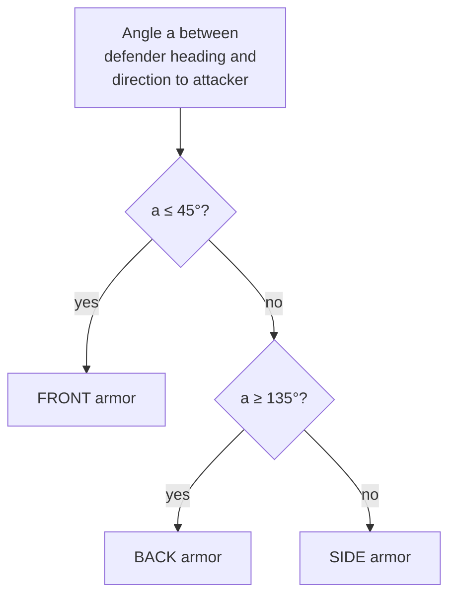

Read it as a compass around the defender: the 90° ahead is front, the 90° behind is back, the two 90° wedges left and right are sides.

---

## 7. Range, targeting and view

| Rule | What it means |
|---|---|
| **7.1** Cannon range by tier, centre to centre: **18 / 21 / 24 / 27 / 30 sq** for tiers 1–5. Range bonuses add-then-cap at **+10%** (max 33 sq). | Seafight goes 5→34; Sea compresses it so tier 1 is playable in PvP. |
| **7.2** The server checks range once per volley using both positions at that tick, with **0.5 sq of grace** in the attacker's favour to absorb one tick of movement. The client draws the ring at the true range. | |
| **7.3** Hold Q = auto-fire. A volley fires when: a target is selected, it is within range + grace, a volley is loaded, and no no-fire zone applies. Out of range the magazine keeps loading and firing resumes by itself when the target comes back. Releasing Q stops firing but keeps the target. | Same as Seafight's persistent attack, but you must hold the key (helps bot detection). |
| **7.4** Targeting: click a ship, or Tab to cycle visible enemies by distance. A ship further than view distance cannot be selected and is dropped when it leaves view. | |
| **7.5** View distance = **60 sq** (twice the maximum range). The server only sends you ships within view + 5 sq. The minimap shows ships within 2 × view. Duel fog (SEA_3) overrides this: only the two duelists exist. | |
| **7.6** Range and view debuffs subtract flat sq for a fixed time, never below 50% of base. | |

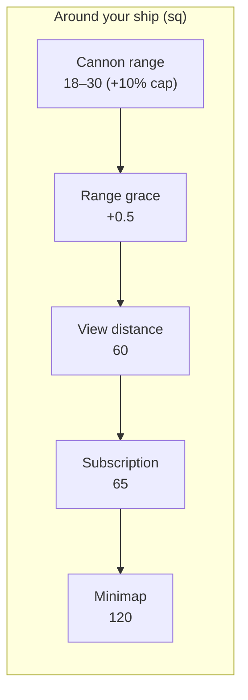

---

## 8. Firing and projectiles

| Rule | What it means |
|---|---|
| **8.1** A volley is resolved on the server the moment it fires. For each cannon the server decides critical, armor face and damage right then (armor and damage numbers in SEA_2_MATH; critical numbers in §8.7). One `HitEvent` per volley: attacker, defender, damage, crit flag, face, flight time. | |
| **8.2** Every cannon in range hits. There is no hit-chance roll and no dodge stat. Variance comes from critical hits and armor faces only. | Seafight rolls dice per cannonball; Sea does not. |
| **8.3** The cannonball flight is visual only. `flight_time = distance / 40 sq/s` (0.45 s at 18 sq, 0.75 s at 30 sq). The client shows the impact and the damage number after the flight; the server applied the damage at fire time. A ship at 0 HP is sunk on the server at once; the client delays the sinking animation by the flight time. | |
| **8.4** You cannot dodge a fired volley by moving. Positioning matters before the shot (range, face), not after. | This is what keeps fights fair on 100–300 ms browser connections. |
| **8.5** Shots go in any direction and over anything. Islands, ships, towers and storms never block a shot. | |
| **8.6** Volleys from a moving ship are identical to volleys from a stopped ship. No accuracy penalty either way. | |
| **8.7** Critical hits: **10%** chance per volley, damage **×1.5** applied after armor. Players and NPCs alike. | The roll is a pure function of the world seed, the tick, the attacker id and the defender id, so two replays of the same command log crit on the same volleys. |
| **8.8** The client shows a critical volley with a larger damage number. It never predicts a crit; the number comes from the server with the damage. | |

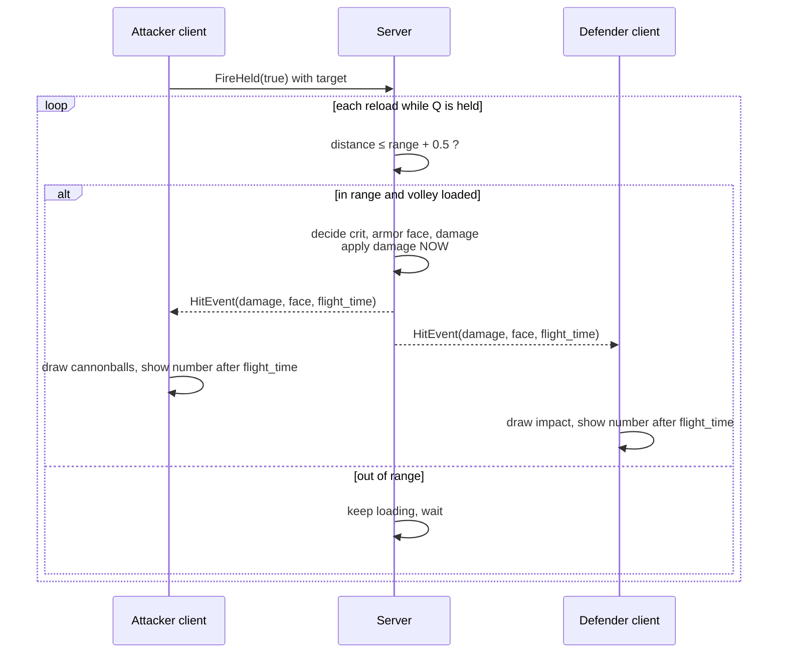

---

## 9. Boarding

| Rule |
|---|
| **9.1** Board is available when: target HP ≤ your Boarding Threshold, distance ≤ **4 sq**, your boarding cooldown is over, and neither ship is in a no-PvP zone. |
| **9.2** Boarding never stops, slows or locks either ship. It is one instant check; the fight continues. |
| **9.3** Cooldown **60 s** vs players, **15 s** vs NPCs. |

What a successful or failed boarding *does* — the haul, the hands lost, the
3 s silence, the 10% of Max HP — is SEA_3_MECHANICS §4.3 and SEA_2_MATH §5.7.
This section only decides when boarding is physically allowed: within 4 sq,
off cooldown, target below the boarding threshold.

Cooldowns: 60 s after boarding a player, 15 s after boarding an NPC. SEA_3's
rule that a given player can be boarded at most once every 5 minutes still
applies and is a separate timer on the victim.

---

## 10. Land, edges and zones

| Rule |
|---|
| **10.1** Land blocks movement and nothing else. A ship whose centre would enter land is held at the boundary. |
| **10.2** Map edges: within **6 sq** of an edge that has a neighbouring map, the "Change map" prompt appears. On confirm the ship appears **8 sq** inside the opposite edge of the next map, stopped, same heading, with target, route and pending volleys cleared. Edges with no neighbour are walls. Confirming is instant on every map. SEA_3 has no map-change countdown — only the duel countdown and the cast-off channel — so there is nothing to defer to. If one is ever added to SEA_3, it applies here. |
| **10.3** Harbor, safe and duel zones are circles (centre, radius) baked per map. Zone tests use the ship centre. |
| **10.4** Island towers use a circle of `TOWER_RANGE` and the same range check and fire-time rules as ships. |
| **10.5** Storms and currents are zones too. One zone system covers everything. |

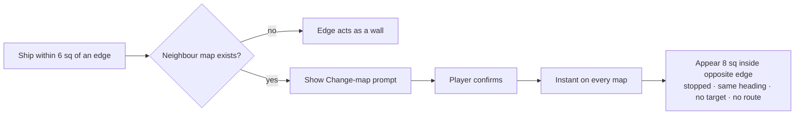

---

## 11. NPC movement

NPCs use exactly the same movement model as players: routes, constant speed, no collisions, land mask.

| Rule |
|---|
| **11.1** NPC speed = base speed of the map's base hull × `NPC_SPEED_FACTOR` for its type (factors in SEA_1 Appendix D). |
| **11.2** Idle: pick a random water point within **25 sq** of spawn every 8–20 s. |
| **11.3** Aggressive NPCs engage any valid target within **20 sq** and give up beyond **60 sq** from spawn, sailing home at full speed. |
| **11.4** Engaged: hold **0.8 × own range** from the target. Sail toward it when further, stop when closer. Never sail away from a target except to go home. Bosses may use scripted patterns. |
| **11.5** Routes are recomputed at most every **500 ms**. |

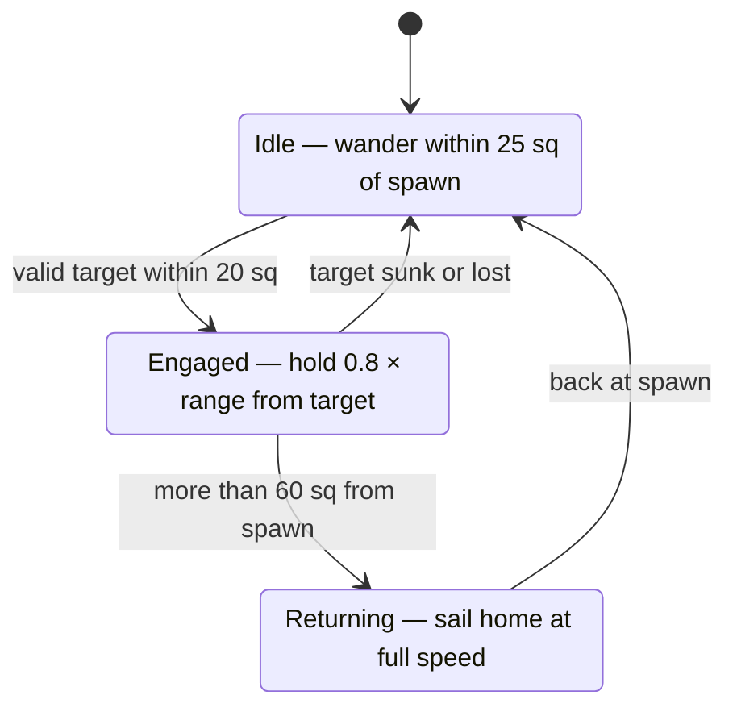

---

## 12. Server tick, network and validation

| Rule | What it means |
|---|---|
| **12.1** Movement is advanced by a scheduled reducer at **10 Hz** (every 100 ms), the same cadence as Seafight. At 5 sq/s that is 0.5 sq per tick. Combat (volleys, reload, damage over time) runs on its own schedule per ship and reads the last tick's positions. | |
| **12.2** The server is the only authority on position, heading, speed and route. Clients never send positions. Clients send: `MoveTo`, `Stop`, `SetTarget`, `FireHeld(bool)`, `Board`, `Repair`. | |
| **12.3** Clients interpolate between ticks from the route and speed they received, and snap to the server value when the error is more than **1.0 sq**. | Straight-line movement makes snaps rare: only packet loss or a course change. |
| **12.4** Each `MoveTo` is validated: inside the map, not more than 8 per second, reachable. Anything else is dropped and counted for the trust score. Perfectly regular `MoveTo` timing and targets that sit at exactly `range − 0.5` are bot signals; because every event is server-stamped, they are measurable. | |
| **12.5** Time bands (every 288000 ticks, which is 8 hours at 10 Hz) rotate wind and respawn storms. The change is applied at the boundary and broadcast once. | |

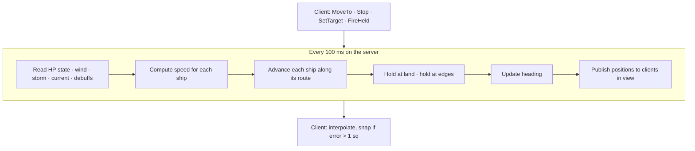

---

## 13. Physics tests that must pass before deployment

Scripted tests against the SpacetimeDB module, in the same spirit as the balance tests in SEA_2_MATH.

| # | Test | Expected |
|---|---|---|
| 1 | Straight line: Brig from (50,50) to (250,50) on open water | x = 100 ± 0.05 after 10.0 s; stopped at (250,50) after 40.0 s |
| 2 | No inertia: reverse direction mid-segment | one tick later the ship has moved back by exactly speed × Δt, no overshoot |
| 3 | Routing around an island | route has ≥ 2 waypoints, ≤ 32, and no segment crosses land |
| 4 | Target inside a land-locked lake | rejected with `NO_PATH`, route unchanged |
| 5 | Two ships ordered to the same point | both arrive and both stay at that exact point |
| 6 | Current pointing into a coast | ship stays on the last water cell, never enters land |
| 7 | Same route downwind / upwind / crosswind | time × 1/1.10 · × 1/0.90 · unchanged |
| 8 | Inside a storm, sailing upwind | speed = base × 0.85 × 0.90 within 0.1% |
| 9 | HP 60% → 40%, then repair above 50% | speed × 0.92 next tick; back to × 1.00 next tick after repair |
| 10 | Build with +35% speed bonuses | moves at exactly base × 1.25 |
| 11 | Tier-5 cannon, target at 30.4 sq and at 30.6 sq | hit at 30.4; no volley at 30.6 |
| 12 | Target leaves range 10 ms after a volley fires | full damage applied; server HP reduced before flight time elapses |
| 13 | Attacker at 44° / 46° / 135° from defender heading | FRONT / SIDE / BACK |
| 14 | Ship sailed east, then stopped | heading stays 90° until next route |
| 15 | Enemy at 61 sq / 59 sq | not subscribed, not targetable / targetable |
| 16 | Stopped 5 sq from the east edge, confirm | appears 8 sq inside west edge of next map, no route, no target |
| 17 | Board with target under threshold at 3.9 sq / 4.1 sq | succeeds / fails |
| 18 | 12 `MoveTo` in one second | 8 accepted, 4 dropped, drops recorded on trust score |
| 19 | NPC chases a player past 60 sq from spawn | turns back, takes no new target until home |
| 20 | Replay the same input log on the server twice | identical positions for every ship on every tick |

---

## 14. Decisions (locked 2026-09-04)

| # | Decision | Chosen | Rejected |
|---|---|---|---|
| 1 | Movement feel | Seafight-exact: instant speed and direction, no turning circle (§4) | speed ramp + turn rate; full turning radius |
| 2 | Speed drop by HP state | Soft: 100% / 92% / 85% (§5.2) | Seafight-strength 100/85/70; none |
| 3 | Hit chance | Deterministic: every cannon in range hits (§8.2) | Seafight dice; range falloff |
| 4 | Map size and tick | 400 × 400 sq, 10 Hz (§3.1, §12.1) | 20 Hz; 300 × 300 |
| 5 | Range by tier | 18 / 21 / 24 / 27 / 30 sq (§7.1) | 20–28 tight; 12–30 Seafight-like |
| 6 | Ship overlap | Ships pass through each other (§4.1.6) | soft push-out |

Reopening any of these means re-running the tests in §13 and re-checking the fight-length targets in SEA_2_MATH.

---

## 15. All constants in one place

These are copied into SEA_2_MATH under "Physics constants". This document wins on any disagreement.

| Constant | Value |
|---|---|
| MAP_SIZE | 400 sq |
| CLIENT_PX_PER_SQ | 32 (client only) |
| TICK_HZ | 10 |
| SNAP_TOLERANCE | 1.0 sq |
| ROUTE_MAX_WAYPOINTS | 32 |
| MOVE_MAX_PER_SEC | 8 |
| HEADING_ANIM_MS | 400 (client only) |
| SPEED_BASE Skiff / Sloop / Brig / Frigate / Galleon | 5.6 / 5.3 / 5.0 / 4.7 / 4.4 sq/s |
| SPEED_BONUS_CAP | 0.25 |
| HP_STATE_MULT (>50% / 25–50% / ≤25%) | 1.00 / 0.92 / 0.85 |
| WIND_STRENGTH | 0.10 |
| WIND_BAND_TICKS | 288000 (8 hours at 10 Hz) |
| STORM_MULT / STORM_RADIUS / STORM_DRIFT | 0.85 / 40 sq / 0.5 sq/s |
| STORM_COUNT / lifetime | 0–2 per map / 10–20 min |
| CURRENT_MAX | 0.3 sq/s |
| SPEED_DEBUFF_FLOOR | 0.50 |
| RANGE_BASE tier 1–5 | 18 / 21 / 24 / 27 / 30 sq |
| RANGE_BONUS_CAP | 0.10 |
| RANGE_GRACE | 0.5 sq |
| VIEW_DISTANCE | 60 sq (subscription +5, minimap ×2) |
| PROJECTILE_SPEED | 40 sq/s (visual only) |
| CRIT_CHANCE | 0.10 |
| CRIT_MULTIPLIER | 1.5 |
| BOARD_THRESHOLD | 0.50 (fraction of the target's Max HP) |
| BOARD_DISTANCE | 4 sq |
| BOARD_COOLDOWN_PLAYER / NPC | 60 s / 15 s |
| EDGE_BAND / EDGE_SPAWN_INSET | 6 sq / 8 sq |
| NPC_WANDER_RADIUS | 25 sq |
| NPC_AGGRO_RANGE / NPC_LEASH_RANGE | 20 sq / 60 sq |
| NPC_HOLD_RANGE | 0.8 × own range |
| NPC_REPLAN_MS | 500 |

---

## Appendix — Seafight reference values

For calibration only. None of these are Sea numbers.

| Thing | Seafight value |
|---|---|
| Map edge | ≈ 418 units (diamond); unit = "square" |
| Movement input | `Move(x,y)` once; server returns a waypoint route |
| Client movement step | every 100 ms, straight line, constant speed |
| Ship–ship collision | none |
| Facing | cosmetic; 4 or 8 sprite directions, user-selectable |
| Base elite hull speed | 385 (≈ 4 sq/s) |
| Sails (4× Bermuda) | +212 |
| Max speed, normal state | 2,465 (≈ 33 sq/s; practical PvP ~600–1,500) |
| HP states | 100–50% / 50–25% / 25–0%; max speeds 2,465 / 2,309 / 1,884 |
| Cannon range | gold 5–25, elite 30, Thunderbolt 31–34, max 51.9 with buffs |
| Range skill | +2 sq per point up to +6 |
| Harpoon range | 10 base, 38.2 max (monsters only) |
| Reload | gold 50 s → 7 s, elite 4.9–8.7 s, floor 1.5 s |
| Hit probability | 25% (8-pdr) → 75% (elite) → 86% (Rift L6) → 100% (Lava) |
| Dodge chance | up to 137% general, 272% vs NPC |
| Critical | base 20% damage; up to 37% chance, +822% damage with everything |
| Attack model | one Attack message; server auto-fires each reload while in range; AbortAttack to stop |
| Projectile | visual only; hit sent as DisplayHit at resolution |
| Boarding | proximity + HP threshold (25%/50%) + bonus vs protection; cooldown 60 s / 15 s |
| Map change | sail into edge band, click; 15 s countdown into Safe Haven, cancelled by damage or movement |
| View distance | hidden stat; Bloodfyre −5 range, −5 view, 10 s, 20 s immunity |
| Movement debuffs | Ice / Burning Ice freeze (5–10%), Heartbreaker "Infatuated" (1%: random heading, no firing), NPC slows |

Sources: Seafight Bible — Cannons, Ammunition, Boarding, Maximum Values (pages 1–2), Options Overview, Mini Map, Changing Maps, Map Regions; seafight.fandom.com — Skills; official-board threads "Ship sailing" (2021), "Ship movement" (2021), "Ship design speed" (2024), "Speed?" (2019), "Speed" (2019), "Max Range" (2021); GitHub Erawz/Seafight-Bot (BotCalculator.cs, BotLogic.cs, Seafight/Messages/*).
